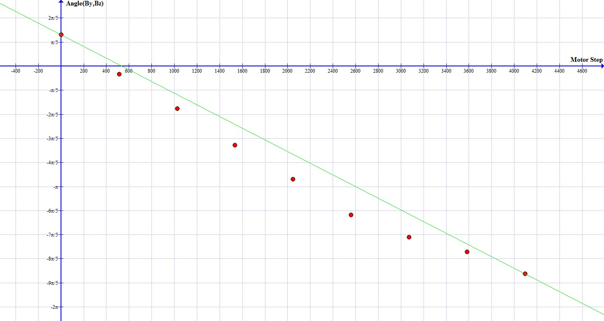

# Calibration

Magnetic sensor constantly reads all three coordinates of the magnetic field (Bx, By, Bz). Arduino calculates angle between By and Bz and uses this value as an input for the calibration. Angle changes as the motor (and the magnet) rotates. During the calibration phase Arduino stores this calculated angle vs. position of the motor. Position of the motor is given in number of stepps the motor made from starting position. Both values are stored in table. For interpolation we used a very simple approach, we fitted a linear function through start point and end point. For this procedure angle needs to be unwraped to awoid discontinuities at 0 and 360 degrees. Parameters of function are stored and used later to determin the current step of the motor from measured magnetic field angle. It's a very rough calibration used for testing the Move Driver! Later we will implement a more accurate calibration.

